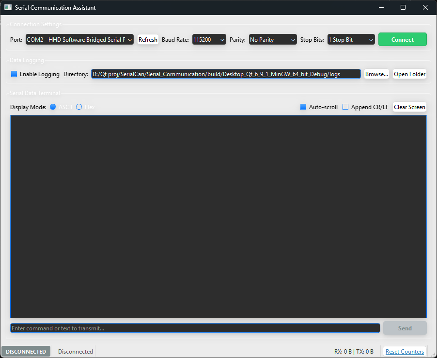

# Qt Serial Communication

[](https://en.wikipedia.org/wiki/C%2B%2B17)
[](https://www.qt.io/)
[](https://cmake.org/)
[](#requirements)

A high-performance, cross-platform Qt/C++ desktop utility designed for monitoring, testing, and debugging serial port devices (RS-232, UART, and virtual COM ports).

---

## Overview

**Qt Serial Communication** is a desktop application developed with modern C++ (C++17) and the Qt framework (`Qt Widgets` and `Qt SerialPort`). It provides an intuitive, reliable graphical interface for communicating with microcontrollers (STM32, Arduino, ESP32), industrial hardware, sensors, and bridged serial devices.

The application simplifies embedded system development and hardware diagnostics by offering:
- Real-time asynchronous data transmission and reception.
- Dual-mode operation supporting both ASCII text and raw Hexadecimal payloads.
- Automated, timestamped session logging to disk.
- Live traffic statistics (RX/TX byte counting) and visual connection monitoring.

---

## Screenshot

<p align="center">
  
</p>

---

## Features

The following features are fully implemented in the application:

* **Serial Port Auto-Detection & Enumeration**: Automatically enumerates physical and virtual COM ports using `QSerialPortInfo` with friendly descriptions (e.g., hardware identifiers and manufacturer details).
* **Port Selection & Refresh**: Instant dynamic port refresh with a dedicated "Refresh" action without requiring an application restart.
* **Baud-Rate Configuration**: Supports standard baud rates including `1200`, `2400`, `4800`, `9600`, `19200`, `38400`, `57600`, and `115200` (default: `115200`).
* **Data Bits**: Standard 8-bit data framing (`8 Data Bits`).
* **Parity Control**: Configurable parity verification (`No Parity`, `Even Parity`, `Odd Parity`, `Mark Parity`, `Space Parity`).
* **Stop Bits Control**: Configurable stop bits (`1 Stop Bit`, `1.5 Stop Bits`, `2 Stop Bits`).
* **Safe Connection Management**: Real-time state toggling ("Connect" / "Disconnect") with input protection (locks configuration controls while an active session is established).
* **Dual Display & Transmission Modes**:
  * **ASCII Mode**: Transmit and view human-readable character strings. Includes an optional **Append CR/LF** (`\r\n`) toggle.
  * **Hexadecimal Mode**: Transmit raw byte streams and view incoming frames formatted as uppercase space-separated hex bytes. Supports arbitrary spaced input (e.g. `0A 1B FF 01`).
* **Serial Terminal Monitor**:
  * Read-only live incoming data display.
  * Configurable **Auto-scroll** toggle for following continuous data streams.
  * **Clear Screen** button for immediate buffer clearing.
* **Persistent Session Logging**:
  * Automatic disk logging of communication sessions into timestamped text files (`logs/log_<PORT>_<TIMESTAMP>.txt`).
  * Distinguishes directional traffic and events with millisecond-precision timestamps: `[TX]`, `[RX]`, `[EVENT]`, and `[ERROR]`.
  * User-selectable log directory via standard directory dialog.
  * One-click **Open Folder** button to open the log folder directly in the system file explorer.
  * Checkbox toggle to enable or disable disk logging on demand.
* **Live Status & Statistics Bar**:
  * Visual connection state badge (`CONNECTED` in vibrant green / `DISCONNECTED` in neutral gray).
  * Active port name and baud rate indicator.
  * Live received (`RX`) and transmitted (`TX`) byte counters.
  * One-click **Reset Counters** action.
* **Modern UI Styling**:
  * Custom dark Aqua stylesheet (`Aqua.qss`) bundled directly inside Qt resources.
  * Soft drop-shadow effects on panel group boxes.
  * Context-aware button coloring (Emerald green for Connect, Crimson red for Disconnect, Blue for Send).
* **Robust Error Handling**:
  * Descriptive user alerts for port open failures, write errors, or invalid hex input strings.
  * Hardware detachment detection (`QSerialPort::ResourceError`, `DeviceNotFoundError`, `PermissionError`) with safe automatic port closure and UI reset.
* **Endianness & Utility Functions (`ByteUtils`)**:
  * Header-only utilities for hex string parsing, hex formatting, little-endian numerical decoding (`float`, `uint16_t`, `uint32_t`), and 8-bit XOR checksum calculation.

---

## Requirements

The project uses standard Qt modules and modern C++ features:

| Component | Minimum Requirement | Recommended / Tested |
| :--- | :--- | :--- |
| **Operating System** | Windows 10 / 11, Linux, macOS | Windows 11 (64-bit) |
| **C++ Standard** | C++17 | C++17 |
| **Qt Framework** | Qt 5.15+ or Qt 6.x | Qt 6.9.1 / Qt 6.10+ |
| **Qt Modules** | `Widgets`, `SerialPort` | `Qt6::Widgets`, `Qt6::SerialPort` |
| **Build System** | CMake 3.16+ | CMake 3.30+ |
| **Compiler** | GCC 9+, Clang 10+, MSVC 2019+ | MinGW GCC 13.1.0 (64-bit) / MSVC 2022 |

---

## Build Instructions

### 1. Clone the Repository

```bash
git clone https://github.com/IamMosiow/qt-serial-communication.git
cd qt-serial-communication
```

### 2. Build with Qt Creator (Recommended)

1. Launch **Qt Creator**.
2. Select **File > Open File or Project...** and choose the `CMakeLists.txt` file in the root folder.
3. Select your configured Qt Kit (e.g. **Desktop Qt 6.9.1 MinGW 64-bit** or **MSVC 2022 64-bit**).
4. Click **Configure Project**.
5. Press `Ctrl + B` (or click **Build**) to compile the application.
6. Press `Ctrl + R` to run.

### 3. Build via Command Line (CMake & Ninja / Make)

Ensure your Qt binaries and compiler are available in your system `PATH`, or specify `CMAKE_PREFIX_PATH`:

```bash
# Configure the build directory
cmake -B build -S . -DCMAKE_BUILD_TYPE=Release -DCMAKE_PREFIX_PATH="<path-to-qt>/6.9.1/mingw_64"

# Compile the target
cmake --build build --config Release
```

### 4. Running the Executable

```bash
# On Windows (PowerShell/CMD):
./build/Serial_Communication.exe

# On Linux/macOS:
./build/Serial_Communication
```

> **Note for Windows deployments**: If running the executable directly outside of Qt Creator or an environment without Qt DLLs in `PATH`, run `windeployqt` to copy the required Qt runtime libraries:
> ```bash
> windeployqt ./build/Serial_Communication.exe
> ```

---

## Usage Guide

1. **Select Port**: Click the **Refresh** button to detect attached serial hardware. Select your target device from the **Port** dropdown.
2. **Configure Parameters**:
   - Choose the matching **Baud Rate** (e.g. `115200`).
   - Set **Parity** (`No Parity`, `Even`, `Odd`, etc.).
   - Set **Stop Bits** (`1 Stop Bit`, `2 Stop Bits`).
3. **Connect**: Click the green **Connect** button.
   - The status badge in the bottom-left will switch to green `CONNECTED`.
   - The button will update to red `Disconnect`.
   - Configuration dropdowns will lock to prevent accidental parameter alterations during communication.
4. **Transmit Data**:
   - Enter your command or message into the bottom input field.
   - Select **ASCII** for plain text messages (check **Append CR/LF** if your receiver expects `\r\n` line endings).
   - Select **Hex** for raw byte arrays (e.g., `01 03 00 00 00 02 C4 0B`).
   - Click **Send** or press `Enter`.
5. **Receive Data**:
   - Received data is streamed into the central terminal monitor.
   - Switch between **ASCII** and **Hex** radio buttons to toggle output representation.
   - Leave **Auto-scroll** checked to automatically track new messages.
6. **Data Logging**:
   - When **Enable Logging** is checked, session transcripts are written to `<app_dir>/logs/`.
   - Click **Browse...** to specify a custom folder.
   - Click **Open Folder** to view written log files in your system file manager.
7. **Disconnect**: Click **Disconnect** to close the serial port safely and finalize the active log session.

---

## Architecture

The project adheres to a clean, decoupled architecture separating the user interface, communication layer, data logging, and utility helpers:

```
┌────────────────────────────────────────────────────────┐
│                      MainWindow                        │
│  (UI Event Handling, Status Bar, Widget Coordination)   │
└───────────────┬────────────────────────┬───────────────┘
                │                        │
       Signals / Slots          Signals / Slots
                │                        │
                ▼                        ▼
┌───────────────────────────────┐  ┌─────────────────────┐
│      SerialCommunication      │  │       Logger        │
│  (QSerialPort, Async I/O,     │  │  (Session Files,    │
│   Hardware Port Enumeration)  │  │   TX/RX Tagging)    │
└───────────────────────────────┘  └─────────────────────┘
                │
         Uses Utilities
                ▼
┌───────────────────────────────┐  ┌─────────────────────┐
│          ByteUtils            │  │    StyleManager     │
│  (Hex Formatting, Checksums,  │  │  (Aqua Theme, QSS,  │
│   Endian Conversions)         │  │   Dynamic Styles)   │
└───────────────────────────────┘  └─────────────────────┘
```

- **`MainWindow`** (`src/ui/mainwindow.h`, `src/ui/mainwindow.cpp`, `src/ui/mainwindow.ui`): Serves as the presentation layer. Coordinates user interactions, terminal output formatting, button states, and the status bar.
- **`SerialCommunication`** (`src/communication/serialcommunication.h`, `src/communication/serialcommunication.cpp`): Encapsulates `QSerialPort` operations, asynchronous `readyRead` notifications, transmission buffers, and port configuration.
- **`Logger`** (`src/logging/logger.h`, `src/logging/logger.cpp`): Manages structured file logging, session rotation, directory creation, and entry formatting with timestamps.
- **`StyleManager`** (`src/ui/stylemanager.h`, `src/ui/stylemanager.cpp`): Centralizes UI styling, Qt resource stylesheet loading (`Aqua.qss`), drop-shadow effects, and stateful button themes.
- **`ByteUtils`** (`src/utils/byteutils.h`): Header-only utility functions for hex conversion, endianness parsing (`float`, `uint16`, `uint32`), and XOR checksum calculations.
- **`resources.qrc`** (`resources/resources.qrc`): Compiles stylesheets and assets directly into the application binary.

For an in-depth breakdown of class designs and signal flows, see [docs/architecture.md](docs/architecture.md).

---

## Project Structure

```
qt-serial-communication/
├── .github/
│   ├── ISSUE_TEMPLATE/
│   │   ├── bug_report.md
│   │   └── feature_request.md
│   └── workflows/
│       └── build.yml
├── docs/
│   ├── images/
│   │   └── screenshot.png
│   └── architecture.md
├── resources/
│   ├── styles/
│   │   └── Aqua.qss
│   └── resources.qrc
├── src/
│   ├── communication/
│   │   ├── serialcommunication.h
│   │   └── serialcommunication.cpp
│   ├── logging/
│   │   ├── logger.h
│   │   └── logger.cpp
│   ├── ui/
│   │   ├── mainwindow.h
│   │   ├── mainwindow.cpp
│   │   ├── mainwindow.ui
│   │   ├── stylemanager.h
│   │   └── stylemanager.cpp
│   ├── utils/
│   │   └── byteutils.h
│   └── main.cpp
├── .gitignore
├── CMakeLists.txt
├── CONTRIBUTING.md
└── README.md
```

---

## Technologies

* **Language**: C++17
* **Framework**: Qt (Core, GUI, Widgets, SerialPort)
* **Build System**: CMake 3.16+
* **Resource System**: Qt Resource System (`RCC`)
* **Styling**: Qt Style Sheets (`QSS`)

---

## Future Improvements

The following features represent realistic potential enhancements planned for future iterations:

- [ ] **Real-Time Data Plotting**: Integrate a plotting backend (such as `QCustomPlot`) to visualize continuous sensor telemetry.
- [ ] **Protocol Parsers & Framers**: Add built-in decoders for standard industrial protocols (e.g., Modbus RTU, NMEA-0183, SLIP).
- [ ] **Custom Command Presets**: Save and execute frequently used commands or macros with single-click buttons.
- [ ] **Terminal Export**: Export received terminal history directly to CSV or JSON formats.
- [ ] **Auto-Reconnect**: Automatically attempt to reopen communication upon transient USB disconnect/reconnect events.
- [ ] **Light / Dark Theme Switching**: Runtime toggling between the Aqua dark stylesheet and a clean light theme.

---

## License

This project is currently unlicensed. All rights are reserved by the author.
