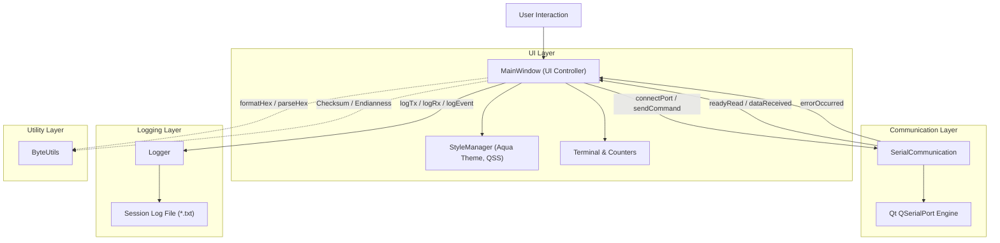
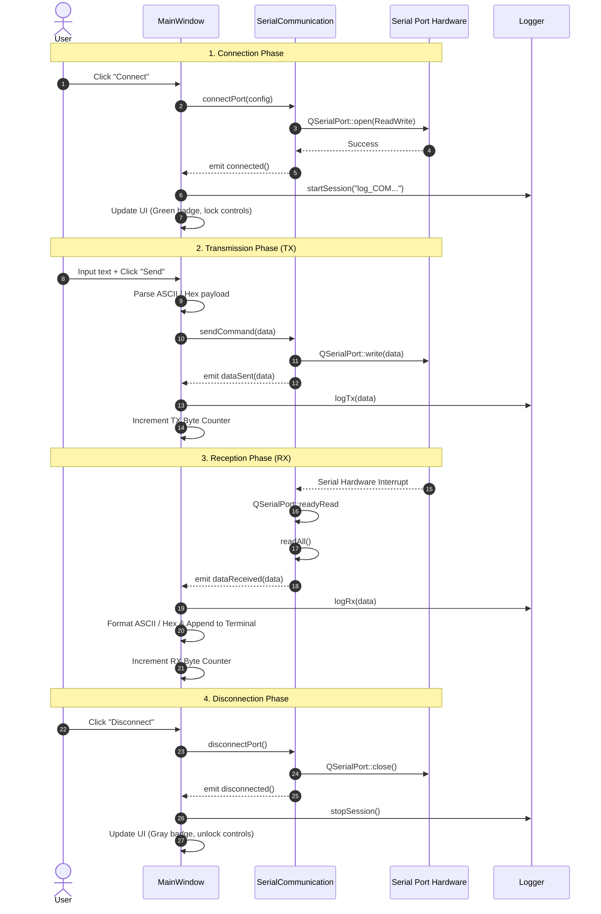

# Architecture Documentation

This document describes the architectural design, component responsibilities, and data flow of the **Qt Serial Communication** application.

---

## 1. Architectural Overview

The application follows an asynchronous, event-driven architecture structured into four distinct layers:

1. **Presentation Layer (`src/ui`)**:
   - Manages the graphical interface, widgets, and user interactions.
   - Encapsulates styling, drop shadows, and responsive controls via `StyleManager`.
2. **Communication Layer (`src/communication`)**:
   - Manages serial device enumeration, configuration, and non-blocking I/O via `QSerialPort`.
   - Dispatches data and hardware events through Qt signals.
3. **Logging Layer (`src/logging`)**:
   - Handles structured recording of communication sessions to disk.
   - Formats log entries with direction indicators (`[TX]`, `[RX]`, `[EVENT]`, `[ERROR]`) and millisecond timestamps.
4. **Utility Layer (`src/utils`)**:
   - Provides stateless helpers for data parsing, hex formatting, little-endian binary unpacking, and checksum calculations.

---

## 2. Component Breakdown

### 2.1 MainWindow (`MainWindow`)
- **Files**: `src/ui/mainwindow.h`, `src/ui/mainwindow.cpp`, `src/ui/mainwindow.ui`
- **Role**:
  - Serves as the central mediator between the user and background services.
  - Controls widget states (e.g., disabling COM selection when connected).
  - Translates user inputs (ASCII text, Hex strings) into byte arrays for transmission.
  - Updates received data terminal view, byte counters, and status bar badges.

### 2.2 Serial Communication (`SerialCommunication`)
- **Files**: `src/communication/serialcommunication.h`, `src/communication/serialcommunication.cpp`
- **Role**:
  - Wraps `QSerialPort` into a clean, reusable component.
  - Implements asynchronous, non-blocking I/O using Qt's `readyRead` signal.
  - Exposes `availablePorts()` to query active serial ports without instantiating communication.
  - Emits normalized signals:
    - `connected()`: Port opened successfully.
    - `disconnected()`: Port closed cleanly or upon hardware fault.
    - `dataReceived(const QByteArray &)`: Incoming payload received.
    - `dataSent(const QByteArray &)`: Payload successfully written to the device buffer.
    - `error(const QString &)`: Human-readable error description.

### 2.3 Logger (`Logger`)
- **Files**: `src/logging/logger.h`, `src/logging/logger.cpp`
- **Role**:
  - Session-based file logging to disk.
  - Rotates log files per connection session: `logs/log_<PORT>_<YYYY-MM-DD_HH-mm-ss>.txt`.
  - Maintains session-level byte and entry counters.
  - Writes structured lines: `[YYYY-MM-DD HH:mm:ss.zzz] [TAG] <Payload>`.
  - Provides a utility to open the log directory in the native file explorer via `QDesktopServices`.

### 2.4 Style Manager (`StyleManager`)
- **Files**: `src/ui/stylemanager.h`, `src/ui/stylemanager.cpp`
- **Role**:
  - Loads application stylesheets (`Aqua.qss`) embedded in `resources/resources.qrc`.
  - Applies programmatic `QGraphicsDropShadowEffect` to containers.
  - Programmatically styles dynamic buttons (`Connect` vs. `Disconnect`) and status badges (`CONNECTED` vs. `DISCONNECTED`).

### 2.5 Byte Utilities (`ByteUtils`)
- **Files**: `src/utils/byteutils.h`
- **Role**:
  - Header-only namespace providing inline helper functions:
    - `formatHex()`: Formats byte arrays to space-separated uppercase hex strings.
    - `parseHex()`: Cleans and decodes arbitrary hex strings into byte arrays.
    - `readFloatLE()`, `readUInt16LE()`, `readUInt32LE()`: Safely extracts Little-Endian primitives from byte arrays.
    - `calculateXorChecksum()`: Computes standard 8-bit XOR checksums across byte buffers.

---

## 3. Communication Lifecycle & Data Flow

---

## 4. Concurrency & Event Loop Model

- The application executes on a single main thread utilizing **Qt's Event Loop** (`QCoreApplication::exec()`).
- All serial operations are **non-blocking asynchronous**:
  - Port reads are triggered on the `QIODevice::readyRead` signal.
  - Port writes are buffered by the operating system through `QSerialPort::write()`.
- This architecture avoids the complexity and race conditions of multi-threading while keeping the user interface smooth and responsive even under heavy serial transmission.
